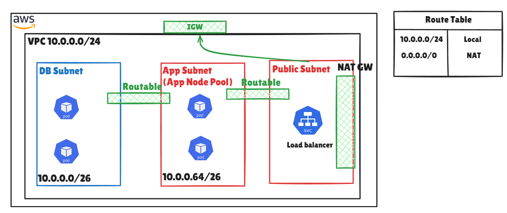
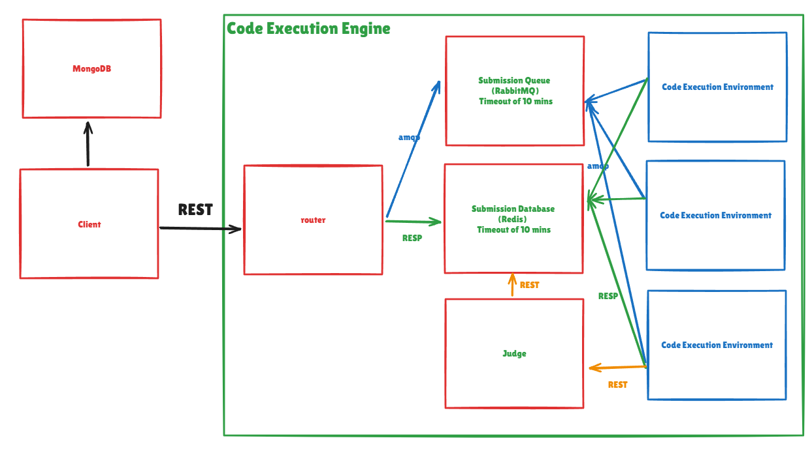

# Algorint

The objective of this project is to develop a system that can execute source code using a specified input and compare the resulting output with the expected output. This system can be likened to platforms such as [HackerRank](https://www.hackerrank.com/) and [LeetCode](https://leetcode.com/).


## High Level Design


## Software Design


## System Implementation

## K6 load testing (WIP)


## How to deploy (WIP)
1. Configure aws cli
```bash
# Get access key from security credentials from aws console
aws configure
```
2. Deploy to AWS
```bash
terraform init
terraform plan
terraform apply
```
3. change kube config file to connect kubectl to AWS cluster (optional)
```bash
aws eks --region $(terraform output -raw region) update-kubeconfig \
    --name $(terraform output -raw cluster_name)
```
4. Destroy all infrastructure
```bash
terraform destroy
```
